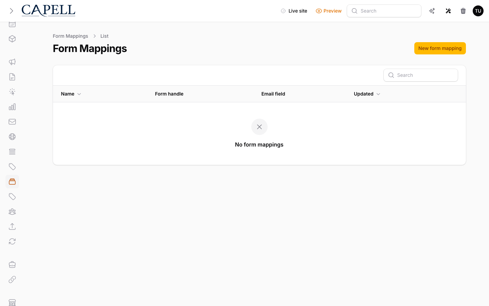
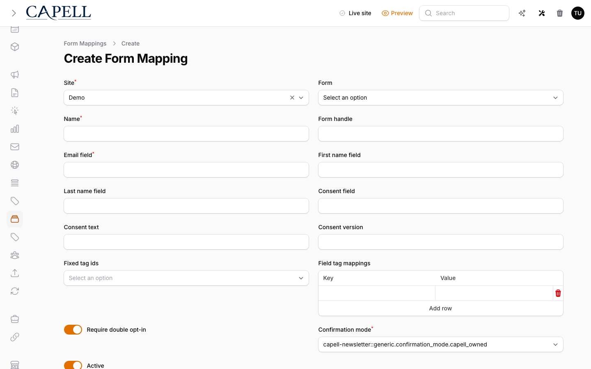

# Form Builder

<!-- prettier-ignore-start -->

## What This Plugin Adds

Form Builder is an **Available**, **Schema-owning** Capell package in the **Capell FormBuilder** product group. It ships as `capell-app/form-builder` and extends these surfaces: admin, frontend.

Build site-scoped forms in Capell and capture spam-filtered, encrypted submissions into a per-site triage inbox with one-click email replies.

After install, admins get package-owned management surfaces and public users may see package-owned frontend output or routes.

Status details:

- Status: Available
- Tier: premium
- Bundle: form-builder
- Composer package: `capell-app/form-builder`
- Namespace: `Capell\FormBuilder`
- Theme key: not applicable

## Why It Matters

**For developers:** The package gives developers package-owned service providers, Actions, Data objects, models, Laravel routes, Filament classes, and Blade views instead of pushing this behaviour into core or application code.

**For teams:** Build site-scoped forms in Capell and capture spam-filtered, encrypted submissions into a per-site triage inbox with one-click email replies.

## Screens And Workflow

Screenshot contract: `docs/screenshots.json`.

- FormBuilder admin index (admin, required).
- Create/edit form schema screen (admin, required).
- Submissions index (admin, required).
- Frontend form output (frontend, required).
- Submission detail view (admin, optional).

## Technical Shape

- Service providers: `Capell\FormBuilder\Providers\FormBuilderServiceProvider`.
- Config files: `packages/form-builder/config/capell-form-builder.php`.
- Migrations: `packages/form-builder/database/migrations/2026_05_10_190849_01_create_form-builder_table.php`, `packages/form-builder/database/migrations/2026_05_10_190849_02_create_submissions_table.php`.
- Models: `Form`, `Submission`.
- Filament classes: `FormResource`, `CreateForm`, `EditForm`, `ListForms`, `ListSubmissions`, `SubmissionResource`, `SubmissionsTable`.
- Livewire components: `FormComponent`, `FormElementComponent`.
- Route files: `packages/form-builder/routes/payments.php`.
- Policies: `FormPolicy`, `SubmissionPolicy`.
- Events: `FormSubmitted`.
- Actions: `ArchiveSubmissionAction`, `BuildFormComponentValidationRulesAction`, `BuildFormStepsAction`, `BuildFormSubmissionPrivacyExportAction`, `BuildFormValidationRulesAction`, `BuildSubmissionPayloadDataAction`, `BuildSubmissionPayloadEntriesAction`, `BuildSubmissionsCsvAction`, `CalculateFormFieldValuesAction`, `CalculateSubmissionSpamScoreAction`, `CreateFormPaymentCheckoutRedirectUrlAction`, `CreateFormPaymentCheckoutSessionAction`, `and 20 more`.
- Data objects: `FormComponentStepStateData`, `FormFieldConditionData`, `FormFieldData`, `FormPaymentCheckoutData`, `FormSettingsData`, `FormStepData`, `FormSubmissionData`, `FormSubmissionPrivacyRecordIdsData`, `ResolvedFormWebhookEndpointData`, `SubmissionMetaData`, `SubmissionPayloadData`, `SubmissionSpamScoreData`.
- Console command classes: `ExportSubmissionsCommand`.
- Manifest contributions: `admin-resource: Capell\FormBuilder\Manifest\FormResourceContribution`, `admin-resource: Capell\FormBuilder\Manifest\SubmissionResourceContribution`, `frontend-component: Capell\FormBuilder\Manifest\FormElementComponentContribution`, `model: Capell\FormBuilder\Manifest\FormModelContribution`, `model: Capell\FormBuilder\Manifest\SubmissionModelContribution`, `route: Capell\FormBuilder\Manifest\FormBuilderPaymentRoutesContribution`.
- Health checks: `Capell\FormBuilder\Health\FormBuilderHealthCheck`.
- Blade views: `packages/form-builder/resources/views/filament/submissions/payload.blade.php`, `packages/form-builder/resources/views/livewire/form-element.blade.php`, `packages/form-builder/resources/views/livewire/form.blade.php`, `packages/form-builder/resources/views/mail/submission-autoresponder.blade.php`, `packages/form-builder/resources/views/mail/submission-notification.blade.php`, `packages/form-builder/resources/views/mail/submission-reply.blade.php`.
- Cache tags: `form-builder`.

## Data Model

- Required tables: `forms`, `submissions`.
- Models: `Form`, `Submission`.
- Migration files: `2026_05_10_190849_01_create_form-builder_table.php`, `2026_05_10_190849_02_create_submissions_table.php`.
- Migration impact: run host migrations through the package install flow before opening package surfaces.
- Deletion/retention behaviour: Docs gap unless the package has an explicit pruning command, retention setting, or tested cascade path.

## Install Impact

- Admin navigation: adds package-owned Filament classes when registered.
- Permissions: `ViewAny:Form`, `View:Form`, `Create:Form`, `Update:Form`, `Delete:Form`, `DeleteAny:Form`, `Restore:Form`, `RestoreAny:Form`, `ForceDelete:Form`, `ForceDeleteAny:Form`, `Reorder:Form`, `ViewAny:Submission`, `View:Submission`, `Reply:Submission`, `Update:Submission`.
- Public routes: route files exist and must be reviewed before public enablement.
- Database changes: package migrations are declared.
- Settings: no package settings declared.
- Queues or schedules: none detected in standard package paths.
- Cache tags: `form-builder`.
- Commands: console command classes detected: `ExportSubmissionsCommand`.

## Common Pitfalls

- Run migrations before opening package resources or public routes.
- Review route middleware, throttling, signed URLs, and public-output safety before exposing routes.
- Keep public Blade and cached HTML free of authoring markers, model IDs, permissions, signed editor URLs, and lazy database queries.
- Keep `composer.json`, `composer.local.json`, `capell.json`, docs, screenshots, and tests aligned when the package surface changes.

## Troubleshooting

| Symptom | Likely cause | Check | Fix |
| --- | --- | --- | --- |
| Package surface is missing after install | Provider or manifest is not loaded | Confirm `capell.json`, package `composer.json`, and provider registration | Reinstall the package, refresh Composer autoload, and clear host caches |
| Admin screen or command fails on missing table | Package migrations have not run | Check the tables listed in `Data Model` | Run host migrations and rerun the focused package test |
| Route returns unexpected output | Route cache, middleware, or signed URL setup does not match the package route file | Check the route files listed in `Technical Shape` | Clear route cache and verify middleware before exposing public routes |
| Public output leaks unexpected state | Render data, cache variation, or authoring boundary has regressed | Check public Blade, cache tags, and public-output safety tests | Move data loading out of Blade and rerun the package public-output tests |

## Quick Start

1. Install the package: `composer require capell-app/form-builder`.
2. Run the required setup: `php artisan migrate`.
3. Open the related Capell admin surface and verify Form Builder appears.

## Next Steps

- [Package docs](docs/README.md)
- [Overview](docs/overview.md)
- [Screenshot contract](docs/screenshots.json)
- [Marketplace assets](docs/assets/marketplace/)
- [Capell content language plan](../../docs/CONTENT_LANGUAGE_PLAN.md)
- [Capell documentation design system](../../docs/DESIGN_SYSTEM.md)
- [Capell and package ERD notes](../../docs/erd/capell-and-package-erds.md)
- Related packages: [Payments](../payments/README.md).
- Focused tests: `vendor/bin/pest packages/form-builder/tests --configuration=phpunit.xml`.

<!-- prettier-ignore-end -->
