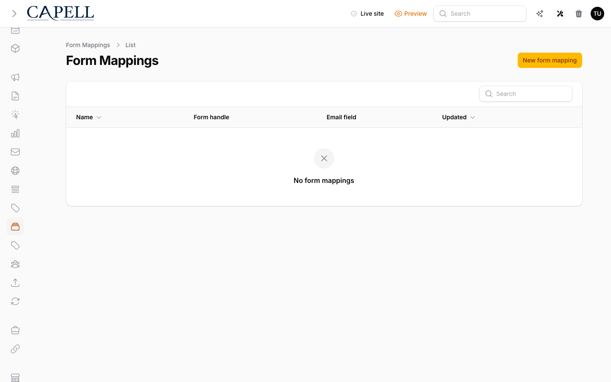

# Using Form Builder

This guide is for editors who build forms and owners deciding where submissions go. Every step uses the labels you see on screen.

## Using Form Builder (editor how-to)

### How to build a form

1. Open **Marketing Studio > Forms** and create a new form.
2. Choose the **Site**, give the form a clear **Name**, and enter a unique **Handle** for the frontend component to resolve.
3. Add fields by choosing each one's **Key**, **Label**, and **Type** (text, email, select, and so on). Reorder the schema entries when their public order needs to change.
4. Mark the fields people must complete as required.
5. Set validation and form settings such as **Store submissions**, **Notification email**, autoresponder, success message or redirect, and webhook URL as needed. Leave **Active** on only when it is ready for visitors.
6. Save the form.

### How to review your forms

1. Open **Marketing Studio > Forms**.
2. The list shows each form's **Name**, **Handle**, site, submission count, and whether it is **Active**.
3. Open any form to edit it, or create a new one.

### How to embed a form on a page

1. In a compatible frontend/page surface, add Form Builder's form element or component.
2. Configure it with the form's **Handle** (or numeric ID) and save the page or layout.
3. Check the public page on the same site. The element renders only an **active** form resolved for that site; an inactive, missing, or cross-site handle shows its fallback instead.

### How to view submissions

1. Open **Marketing Studio > Form submissions**.
2. Triage entries that are **New**, **Read**, **Spam**, or **Archived**.

3. Choose **View payload** on an entry to inspect the stored submitted fields.
4. Use **Mark read**, **Mark spam**, **Archive**, or the legal-hold action as appropriate. **Reply** is available when the system can resolve a reply email address from that submission.

### How to get notified

1. In the form's settings, set a **Notification email**.
2. Save and submit a test through the public form. Check the recipient inbox and spam folder; notifications are sent when the form receives a submission.

## Rolling out Form Builder (for owners)

### Turn on first

- **One clear form with notifications.** Build a simple contact or enquiry form and confirm submissions and notifications work before adding more.

### Add when needed

| Need                               | Enable                            |
| ---------------------------------- | --------------------------------- |
| Stop junk submissions              | Spam protection and **Mark spam** |
| Route enquiries to the right inbox | A **Notification email** per form |

### Don't enable yet

- Don't add lots of fields. Short forms get more submissions. Add fields only when you truly need the data.

### Who does what

| Role       | First useful screen                                       |
| ---------- | --------------------------------------------------------- |
| Editor     | **Forms** and **Form submissions** in Marketing Studio    |
| Site owner | Form settings: **Notification email**, storage, and spam protection |

## Troubleshooting for editors

| What you see                      | What it means                                   | What to do                                                      |
| --------------------------------- | ----------------------------------------------- | --------------------------------------------------------------- |
| I'm not getting submission emails | No notification email is set, or it is in spam  | Set a **Notification email**, submit a public-form test, and check the recipient spam folder |
| Lots of junk submissions          | Spam is getting through                         | Enable spam protection and **Mark spam** on the junk entries    |
| People can't submit the form      | A required field or validation is blocking them | Check which fields are required and that their rules make sense |
| The form isn't on the page        | Its element has no valid active form handle for this site | Check the form's **Active** state, site, and handle in the page or layout element |
